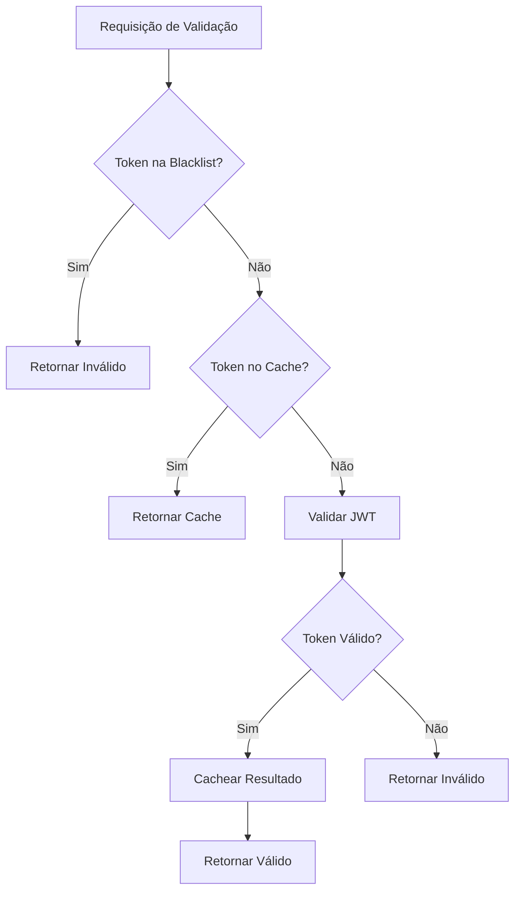
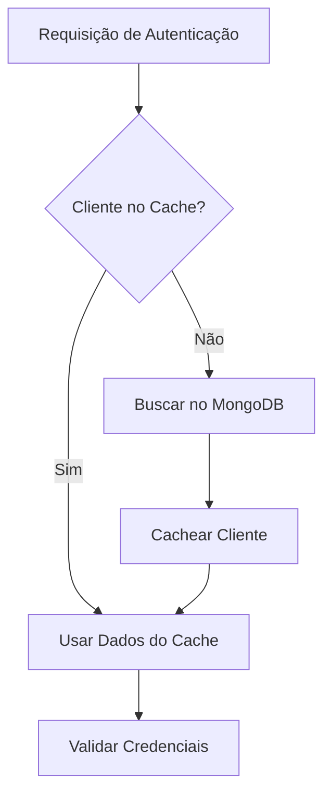

# 🔴 Redis Usage Documentation - Security Token Service

Esta documentação detalha todos os usos do Redis na aplicação Security Token Service.

## 📋 **Visão Geral dos Usos**

O Redis é utilizado para três propósitos principais na aplicação:

1. **Rate Limiting** - Controle de taxa de requisições por IP
2. **Token Validation Cache** - Cache de validações de tokens JWT
3. **Client Data Cache** - Cache de dados de clientes do MongoDB

## 🚦 **1. Rate Limiting**

### **Propósito**
Prevenir ataques de força bruta limitando o número de requisições por IP por minuto.

### **Estrutura das Chaves**
```
rate_limit:{client_ip}
```

### **Exemplo de Dados**
```redis
Key: rate_limit:192.168.1.100
Value: 15
TTL: 45 segundos
```

### **Configurações por Ambiente**
| Ambiente | Limite | TTL | Habilitado |
|----------|--------|-----|------------|
| dev | 100 req/min | 1 min | ✅ |
| test | 1000 req/min | 1 min | ❌ |
| prod | 30 req/min | 1 min | ✅ |

### **Comandos Redis para Monitoramento**
```bash
# Ver todos os rate limits ativos
KEYS rate_limit:*

# Ver contador de um IP específico
GET rate_limit:192.168.1.100

# Ver tempo restante para reset
TTL rate_limit:192.168.1.100

# Resetar rate limit de um IP (admin)
DEL rate_limit:192.168.1.100
```

## 🎫 **2. Token Validation Cache**

### **Propósito**
Cachear validações de tokens JWT para melhorar performance e reduzir processamento de criptografia.

### **Estrutura das Chaves**
```
token_cache:{token_sha256_hash}
token_blacklist:{token_sha256_hash}
```

### **Exemplo de Dados**
```redis
# Cache de validação
Key: token_cache:a1b2c3d4e5f6...
Value: {"valid":true,"clientId":"client1","clientName":"App 1","scopes":["read","write"],"issuedAt":"2023-...","expiresAt":"2023-...","message":"Token válido"}
TTL: 300 segundos

# Blacklist de token
Key: token_blacklist:a1b2c3d4e5f6...
Value: blacklisted
TTL: 3600 segundos
```

### **Configurações por Ambiente**
| Ambiente | TTL Cache | TTL Blacklist | Habilitado |
|----------|-----------|---------------|------------|
| dev | 2 min | - | ✅ |
| test | 1 min | - | ❌ |
| prod | 10 min | Até expiração | ✅ |

### **Comandos Redis para Monitoramento**
```bash
# Ver todos os tokens em cache
KEYS token_cache:*

# Ver tokens na blacklist
KEYS token_blacklist:*

# Ver detalhes de uma validação específica (exemplo)
GET token_cache:a1b2c3d4e5f6789012345678901234567890abcdef

# Limpar cache de tokens (cuidado!)
DEL $(redis-cli KEYS token_cache:*)
```

### **Fluxo de Validação**


## 👤 **3. Client Data Cache**

### **Propósito**
Cachear dados de clientes do MongoDB para reduzir consultas ao banco de dados.

### **Estrutura das Chaves**
```
client_cache:{client_id}
```

### **Exemplo de Dados**
```redis
Key: client_cache:client1
Value: {"id":"507f1f77bcf86cd799439011","clientId":"client1","clientSecret":"$2a$12$...","name":"Aplicação de Exemplo 1","scopes":["read","write"],"active":true,"createdAt":"2023-...","updatedAt":"2023-..."}
TTL: 900 segundos
```

### **Configurações por Ambiente**
| Ambiente | TTL | Habilitado |
|----------|-----|------------|
| dev | 5 min | ✅ |
| test | 1 min | ❌ |
| prod | 30 min | ✅ |

### **Comandos Redis para Monitoramento**
```bash
# Ver todos os clientes em cache
KEYS client_cache:*

# Ver dados de um cliente específico
GET client_cache:client1

# Ver quantos clientes estão em cache
EVAL "return #redis.call('keys', 'client_cache:*')" 0

# Invalidar cache de um cliente específico
DEL client_cache:client1
```

### **Fluxo de Autenticação**


## 📊 **Monitoramento e Métricas**

### **Comandos Úteis para Monitoramento**

```bash
# Conectar ao Redis
docker exec -it redis-container redis-cli
AUTH Teste@123

# Informações gerais do Redis
INFO memory
INFO stats

# Ver todas as chaves por tipo
KEYS rate_limit:*
KEYS token_cache:*
KEYS token_blacklist:*
KEYS client_cache:*

# Estatísticas de uso
INFO keyspace

# Ver chaves que vão expirar em breve
EVAL "local keys = redis.call('keys', '*'); local result = {}; for i=1,#keys do local ttl = redis.call('ttl', keys[i]); if ttl > 0 and ttl < 60 then table.insert(result, keys[i] .. ':' .. ttl); end; end; return result;" 0
```

### **Métricas Importantes**

1. **Hit Rate do Cache de Tokens**: % de validações que usaram cache
2. **Hit Rate do Cache de Clientes**: % de autenticações que usaram cache
3. **Rate Limit Violations**: Número de IPs bloqueados por minuto
4. **Memória Redis**: Uso de memória pelo Redis
5. **TTL Distribution**: Distribuição dos tempos de vida das chaves

## ⚙️ **Configurações de Performance**

### **Configurações Redis Recomendadas**
```bash
# No redis.conf para produção
maxmemory 256mb
maxmemory-policy allkeys-lru
timeout 300
tcp-keepalive 60
```

### **Configurações de Aplicação**
```properties
# Produção
cache.token.ttl-minutes=10      # Balance entre performance e memory
cache.client.ttl-minutes=30     # Clientes mudam raramente
rate-limit.requests-per-minute=30  # Strict rate limiting

# Development
cache.token.ttl-minutes=2       # TTL baixo para testing
cache.client.ttl-minutes=5      # TTL baixo para testing
rate-limit.requests-per-minute=100 # Permissive para dev
```

## 🔧 **Troubleshooting**

### **Problemas Comuns**

**1. Redis Connection Refused**
```bash
# Verificar se Redis está rodando
docker-compose ps redis

# Ver logs do Redis
docker-compose logs redis
```

**2. Cache Miss Rate Alto**
- Verificar TTL não está muito baixo
- Verificar se aplicação está invalidando cache desnecessariamente
- Monitor: `INFO stats` → `keyspace_misses` vs `keyspace_hits`

**3. Memória Redis Crescendo**
```bash
# Ver uso de memória por tipo de dados
MEMORY USAGE token_cache:*
MEMORY USAGE client_cache:*

# Verificar policy de eviction
CONFIG GET maxmemory-policy
```

**4. Rate Limiting Não Funcionando**
- Verificar configuração `rate-limit.enabled=true`
- Verificar IPs por trás de proxy (X-Forwarded-For)
- Ver logs: `Rate limit exceeded for IP`

### **Scripts de Limpeza**
```bash
#!/bin/bash
# cleanup-redis.sh

echo "Limpando caches expirados..."

# Tokens expirados (verificar TTL < 0)
redis-cli --scan --pattern "token_cache:*" | xargs -I {} sh -c 'if [ $(redis-cli TTL {}) -eq -1 ]; then redis-cli DEL {}; fi'

# Rate limits antigos
redis-cli --scan --pattern "rate_limit:*" | xargs -I {} sh -c 'if [ $(redis-cli TTL {}) -eq -1 ]; then redis-cli DEL {}; fi'

echo "Limpeza concluída."
```

## 📈 **Roadmap de Melhorias**

### **Próximas Implementações**
1. **Session Management**: Cache de sessões de usuário
2. **API Key Cache**: Cache de chaves de API se implementado
3. **Metrics Cache**: Cache de métricas agregadas
4. **Distributed Locking**: Locks distribuídos para operações críticas
5. **Pub/Sub**: Notificações em tempo real entre instâncias

### **Otimizações Futuras**
1. **Redis Cluster**: Para high availability
2. **Redis Sentinel**: Para failover automático
3. **Compression**: Compressão de dados grandes
4. **Pipeline Operations**: Batch operations para performance

---

**📞 Para suporte**: Consulte os logs da aplicação e do Redis, ou use os comandos de monitoramento listados acima.